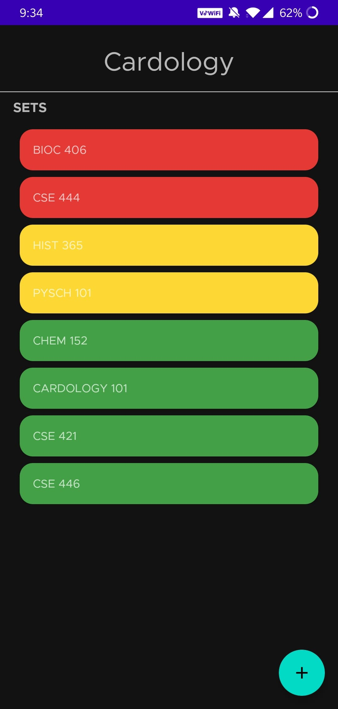
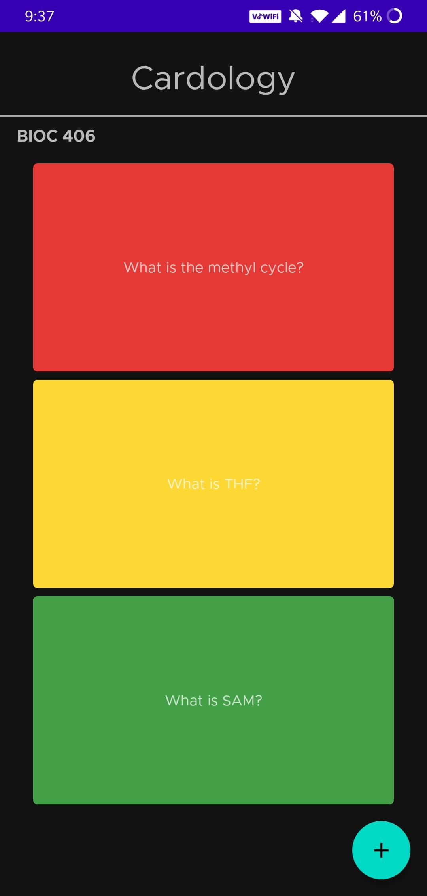
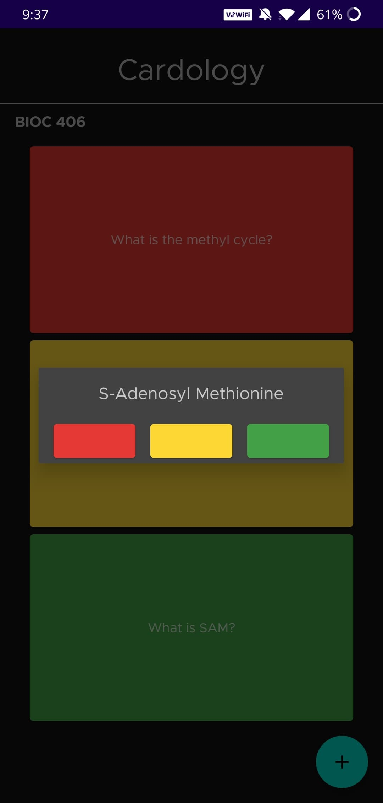

# Cardology

 

Cardology is a simple, self-arranging notecard app that lets you create
text notecards and label with with red, yellow, or green colors, denoting
their priority. Red means highest priority and is always shown at the top of a
stack of flashcards while green is at the bottom. Similarly, the user can mark
sets of cards with the same color system.

This is a simple app that I am building to learn native Android Development.
So far, I have used things such as Android Room architecture for persistant
SQLite storage for cards and sets, adapters and RecyclerViews for lists,
dialog fragments, and basic XML layout structure.

### 0.1 - 04-02-2020

#### Added
Initial release with basic functionality of adding remove cards and sets,
labeling cards and sets with colors and re organizing upon color changes.
